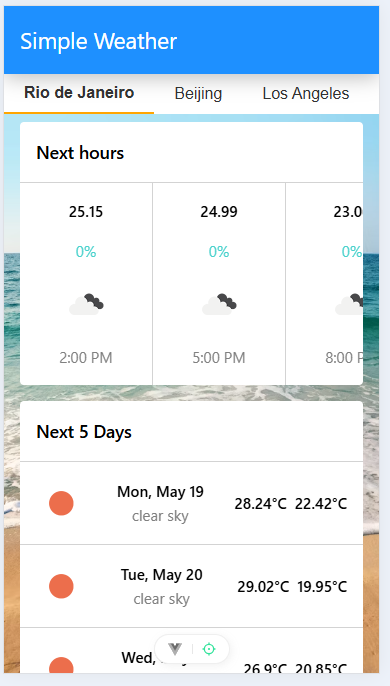

# vue-simple-weather-app

This is a simple weather app. The app, by default shows 3 cities in 3 different tabs. Clicking on each tab shows the weather forecast for those locations. To get the forecast, I used https://openweathermap.org/api. Since I used the free tier, I only have access to the 2.5/forecast endpoint. You need an API key from openweathermap.org to run this.

# Sample



## 🔧 Environment Setup

This project uses environment variables to manage the API key.

### 1. Create a `.env` file

Copy the provided example file:

```bash
cp .env.example .env
```

Edit the new .env file and replace the placeholder with your actual OpenWeather API key. The .env file is not ignored by git so it will not be committed.

## Recommended IDE Setup

[VSCode](https://code.visualstudio.com/) + [Volar](https://marketplace.visualstudio.com/items?itemName=Vue.volar) (and disable Vetur).

## Project Setup

```sh
npm install
```

### Compile and Hot-Reload for Development

```sh
npm run dev
```

### Type-Check, Compile and Minify for Production

```sh
npm run build
```

### Run Unit Tests with [Vitest](https://vitest.dev/)

```sh
npm run test:unit
```

### Run End-to-End Tests with [Cypress](https://www.cypress.io/)

```sh
npm run test:e2e:dev
```

This runs the end-to-end tests against the Vite development server.
It is much faster than the production build.

But it's still recommended to test the production build with `test:e2e` before deploying (e.g. in CI environments):

```sh
npm run build
npm run test:e2e
```

### Lint with [ESLint](https://eslint.org/)

```sh
npm run lint
```
